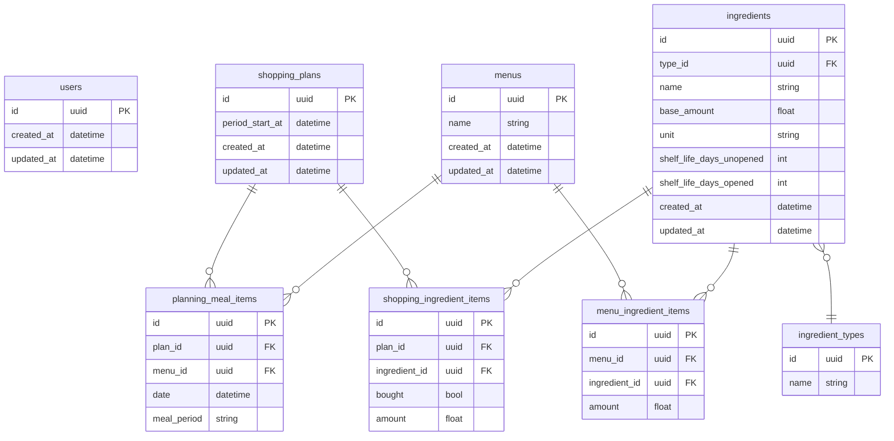

# 1人暮らし向け買い物リスト「meal-compass」

# 概要

このWebアプリケーションは「一人暮らしの自炊を楽にする」という目的を持ち、「買い物リスト」という機能を主軸にサービスを提供する。

現時点では（Minimum Viable Productを開発する時点では）usersテーブルは使用しない。（認証機能は実装せず、ログインは不要）

このアプリのMVPを開発するにあたって実装する機能は、「自炊する食事をユーザーが指定する機能」、「ユーザーの指定した食事（例えば『明日の昼ごはん』など）ごとにメニューを自動で提案する機能」、「提案したメニューに応じて買い物リストを生成する機能」の３つである。

「自動提案」の機能は、今後「一人暮らしの自炊」に向けて最適化を図るべきだが、MVPの段階では、「ランダムに重複なく選ぶ」というアルゴリズムで実装する。

バックエンドシステムにはGo言語（Gin）、フロントエンドシステムにはTypeScript（React）、データベースにはMySQL、ORMとしてGORMを使用する。

開発環境にはDocker/Docker Composeを使用し、本番環境にはAWSのECSとRDS、ALBを使用する。

また、GitHubを利用してバージョン管理を行い、GitHub Actionsを用いてCDワークフローを実現する。

# フロントエンドアプリケーションについて

使いやすくシンプルなUIと、魅力的なデザインが求められる。

以下にメインカラーを指定する。

- 4B352A
- CA7842
- B2CD9C
- F0F2BD

# バックエンドアプリケーションについて

アプリケーションのアルゴリズムを主に担当する。

メニューや買い物リストの生成機能を持つ。

MVPでは管理者ページを作成せず、世の中に存在する「ingredients」の情報や「menus」の情報をアプリ上の操作では登録することが出来ないため、また、開発環境の動作確認で使用するため、ダミーデータをDBに登録するfakerのような機能を持つ。

# DB設計



# API設計

## POST api/create-new-plan

shopping_planが新たに作成され、関連するplanning_mealやshopping_ingredientsも作成される。

period_start_atはリクエストがあった日付が自動で登録され、自炊/買い物計画の起点の日付となる。

### Request

parameters

| name | in | type | required | description |
| --- | --- | --- | --- | --- |
| planned_meals | body | array | true | ユーザーが選択した自炊する予定の食事を配列で指定する。配列の要素は「date_offset」と「meal_period」のパラメータ2つを含む JSON 。 |
| date_offset | “planned_meals” | int | true | 「何日後の食事か」を指定。例えば今日の食事なら0、明日の食事なら1を指定。 |
| meal_period | “planned_meals” | string | true | 「朝ご飯か、昼か晩か」を指定。 ”MORNING” 、 ”LUNCH” または ”DINNER” を指定する。 |

body

```json
{
  "planned_meals": [
    {
      "date_offset": 0,
      "meal_period": "MORNING"
    }
  ]
}
```

### Response

- 201 created：成功すれば「shopping_plan_id」と、自動生成された「指定日分のメニュー」と「買い物リスト」を返す。

```json
{
  "shopping_plan_id": "7d6d6bbe-4522-11f0-8dcb-fe5c80306467",
  "meals": [
    {
      "date": "2020-12-31",
      "meal_period": "MORNING",
      "menu_name": "バタートースト",
      "ingredients": [
	      {
	        "name": "食パン",
	        "amount": 1.0,
	        "unit": "枚",
	      },
	      {
	        "name": "バター",
	        "amount": 2.0,
	        "unit": "g",
	      }
      ],
    }
  ],
  "ingredients": [
    {
      "name": "食パン",
      "type": "パン類",
      "amount": 5.0,
      "unit": "枚",
      "bought": false
    },
    {
      "name": "バター",
      "type": "調味料",
      "amount": 100.0,
      "unit": "g",
      "bought": false
    }
  ]
}
```

- 400 Bad Request：bodyの内容が指定の形式に従っていない場合は400エラーを返す。
- 422 Unprocessable Entity：date_offsetが負数の場合やmeal_periodが”MORNING”, “LUNCH”, “DINNER”以外の場合は422エラーを返す。

## GET api/menu-list/{shopping_plan_id}

### Request

parameters

| name | in | type | required | description |
| --- | --- | --- | --- | --- |
| shopping_plan_id | path | string | true | plan作成時に取得したidを指定する。 |

body: none

### Response

- 200 success：成功すれば「meal」の配列を返す。

```json
{
  "meals": [
    {
      "date": "2020-12-31",
      "meal_period": "MORNING",
      "menu_name": "バタートースト",
      "ingredients": [
	      {
	        "name": "食パン",
	        "amount": 1.0,
	        "unit": "枚",
	      },
	      {
	        "name": "バター",
	        "amount": 2.0,
	        "unit": "g",
	      }
      ],
    }
  ]
}
```

- 404 not found：idに一致するものが無ければ、404エラーを返す。

## GET api/ingredient-list/{shopping_plan_id}

### Request

parameters

| name | in | type | required | description |
| --- | --- | --- | --- | --- |
| shopping_plan_id | path | string | true | plan作成時に取得したidを指定する。 |

body: none

### Response

- 200 success：成功すれば「ingredient」の配列を返す。

```json
{
  "ingredients": [
    {
      "id": "8e21cf3d-4522-11f0-8dcb-fe5c80306467",
      "name": "食パン",
      "type": "パン類",
      "amount": 5.0,
      "unit": "枚",
      "bought": false
    },
    {
      "id": "90740e30-4522-11f0-8dcb-fe5c80306467",
      "name": "バター",
      "type": "調味料",
      "amount": 100.0,
      "unit": "g",
      "bought": false
    }
  ]
}
```

- 404 not found：idに一致するものが無ければ、404エラーを返す。

## PATCH api/shopping_ingredient_items/{item_id}

### Request

parameters

| name | in | type | required | description |
| --- | --- | --- | --- | --- |
| item_id | path | string | true | 買い物リストで「購入済み」または「未購入」とマークする材料のidを指定する。 |
| bought | body | bool | true | 「購入済み」とマークする場合はtrue、「未購入」とする場合はfalseを指定。 |

body

```json
{
  "bought": true
}
```

### Response

- 200 success：成功すれば「ingredient」の情報を返す。

```json
{
  "id": "8e21cf3d-4522-11f0-8dcb-fe5c80306467",
  "name": "食パン",
  "type": "パン類",
  "amount": 5.0,
  "unit": "枚",
  "bought": true
}
```

- 404 not found：idに一致するものが無ければ、404エラーを返す。

# 開発環境ディレクトリ/ファイル構成

下記構成を軸に、随時必要なディレクトリ/ファイルを追加/削除する。

```
root/
  ├── .github/
  │   └── workflows/
  │       └── deploy.yml
  ├── backend/
  │   ├── cmd/
  │   │   └── server/
  │   │       └── main.go
  │   ├── internal/
  │   │   ├── adapter/
  │   │   │   ├── handler/
  │   │   │   │   ├── router.go
  │   │   │   │   ├── plan_handler.go
  │   │   │   │   └── ingredient_handler.go
  │   │   │   └── repository/
  │   │   │       ├── gorm.go
  │   │   │       ├── plan_repository.go
  │   │   │       ├── menu_repository.go
  │   │   │       └── ingredient_repository.go
  │   │   ├── config/
  │   │   │   └── config.go
  │   │   ├── domain/
  │   │   │   ├── model/
  │   │   │   │   ├── base.go
  │   │   │   │   ├── shopping_plan.go
  │   │   │   │   ├── planning_meal_item.go
  │   │   │   │   ├── shopping_ingredient_item.go
  │   │   │   │   ├── menu.go
  │   │   │   │   ├── menu_ingredient_item.go
  │   │   │   │   ├── ingredient.go
  │   │   │   │   └── ingredient_type.go
  │   │   │   └── repository/
  │   │   │       ├── plan_repository.go
  │   │   │       ├── menu_repository.go
  │   │   │       └── ingredient_repository.go
  │   │   ├── seeder/
  │   │   │   └── seeder.go
  │   │   └── usecase/
  │   │       └── plan_usecase.go
  │   ├── migrations/
  │   │   └── 0001_create_initial_tables.up.sql
  │   ├── go.mod
  │   ├── go.sum
  │   └── Dockerfile
  ├── frontend/
  │   ├── Dockerfile              # 本番環境向けコンテナのビルド設定
  │   ├── index.html              # アプリケーションのエントリーポイントとなるHTMLファイル
  │   ├── package.json            # プロジェクト情報と依存ライブラリの管理
  │   ├── tsconfig.json           # TypeScriptのコンパイル設定 (アプリケーション用)
  │   ├── tsconfig.node.json      # TypeScriptのコンパイル設定 (Node.js環境用)
  │   ├── vite.config.ts          # Viteの開発サーバーやビルドに関する設定
  │   └── src/                    # ソースコードのメインディレクトリ
  │       ├── App.tsx             # アプリケーションのルートコンポーネント、ルーティング設定
  │       ├── main.tsx            # アプリケーションのエントリーポイント (DOMへの描画)
  │       ├── vite-env.d.ts       # Vite環境用の型定義 (CSS Modulesなど)
  │       ├── api/                # バックエンドAPIとの通信ロジック
  │       │   ├── apiClient.ts    # APIクライアントの共通設定 (axios)
  │       │   └── shoppingPlan.ts # 買い物計画関連のAPI関数群
  │       ├── assets/             # 画像やグローバルCSSなどの静的リソース
  │       │   └── styles/
  │       │       ├── global.css  # グローバルなスタイル定義
  │       │       └── variables.css # 色やフォントなどのCSS変数
  │       ├── components/         # 再利用可能なUIコンポーネント
  │       │   ├── layout/         # ヘッダーやフッターなどのレイアウト用
  │       │   │   ├── Header.tsx
  │       │   │   └── Footer.tsx
  │       │   └── ui/             # 汎用的なUIパーツ
  │       │       ├── Button.tsx
  │       │       ├── Button.module.css
  │       │       ├── Checkbox.tsx
  │       │       └── Checkbox.module.css
  │       ├── contexts/           # React Context APIを用いた状態管理
  │       │   └── ShoppingPlanContext.tsx
  │       ├── hooks/              # カスタムフック (ロジックの再利用)
  │       │   └── useShoppingPlan.ts
  │       ├── pages/              # 各ページに対応するコンポーネント
  │       │   ├── TopPage.tsx
  │       │   ├── TopPage.module.css
  │       │   ├── ResultPage.tsx
  │       │   └── ResultPage.module.css
  │       ├── types/              # TypeScriptの型定義
  │       │   └── index.ts
  │       └── utils/              # 汎用的なヘルパー関数
  │           └── dateFormatter.ts
  ├── compose.yml
  ├── .env
  └── .env.local
```
